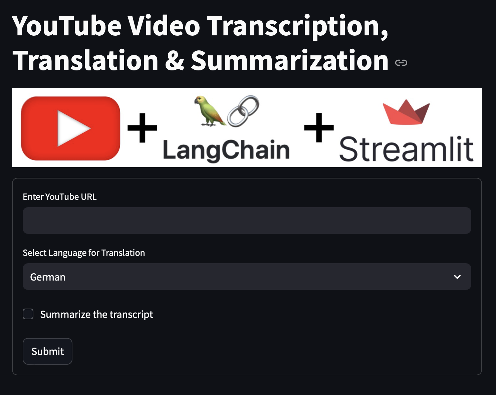

# Streamlit YouTube Transcription, Translation, and Summarization App

This project is a web application built using Streamlit that takes a YouTube video URL, fetches its transcription, provides an option to summarize it, and translates the transcription into a selected language (German, Spanish, or Hindi). The app is powered by OpenAI's GPT models using the Langchain library.

## Features
1. **YouTube Transcription**: Fetches the transcription of a YouTube video using `langchain_community.document_loaders.YoutubeLoader`.
2. **Summarization**: Provides a checkbox to summarize the transcription.
3. **Translation**: Allows translation of the transcription to German, Spanish, or Hindi using a Langchain-based translation chain.

## Requirements

To run this project, you need to have the following installed:

- Python 3.9 or above
- Docker (if you wish to run the application inside a container)
- An OpenAI API key (set it as an environment variable)

## Local Setup

### 1. Clone the Repository

```bash
git clone https://github.com/sher-somas/langchain-youtube-project.git
cd langchain-youtube-project
pip install -r requirements.txt
export OPENAI_API_KEY="your-openai-api-key"
streamlit run app.py
```

### 2. Running the Application with Docker
```bash
docker build -t streamlit-langchain-app .
docker run -p 8501:8501 -e OPENAI_API_KEY="your-openai-api-key" streamlit-langchain-app
```

### 3. Application GUI



